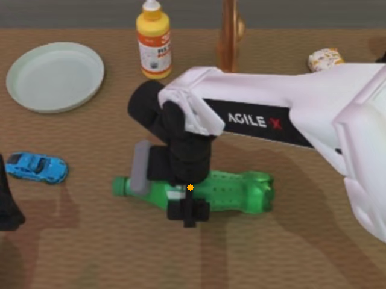
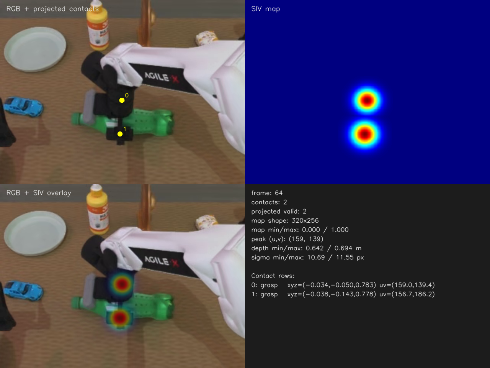

# SIV-WAM

**Spatial Interaction Value Guided World-Action Modeling for Contact-Rich Manipulation**

SIV-WAM is a research codebase for a structured **world → spatial interaction value → action** interface in robot manipulation. Instead of decoding continuous actions directly from dense future RGB features, the model predicts Spatial Interaction Value (SIV) maps and uses them as a control-oriented spatial interface between future-world prediction and action generation.

> This release is cleaned from the server-side source tree used to run the project. Datasets, pretrained weights, simulator installations, and training outputs are intentionally excluded from GitHub.

## Project at a glance

| Item | Description |
| --- | --- |
| Problem | Make future-world representations more useful for contact-rich robot control |
| Representation | Dense, continuous SIV heatmaps aligned with future camera views |
| Backbone | Wan-style video/world-action modeling code with multi-view inputs |
| Action | Continuous dual-arm action chunks; default RoboTwin/LeRobot interface is 16D |
| Training | Stage I joint world/value/action training; Stage II value-guided action post-training |
| Data pipeline | Contact or EEF proxy → 3D-to-2D projection → Gaussian SIV map → optional VAE latent |
| Evaluation | RoboTwin clients, geometry tests, SIV map metrics, and intervention ablations |
| Primary environment | Linux, Python 3.10+, NVIDIA GPU, CUDA-compatible PyTorch |

## Why SIV maps?

A future RGB latent must preserve appearance, texture, background, occlusion, and motion. A controller usually needs a smaller question: **where should the next meaningful interaction happen?** SIV maps make that spatial prior explicit and provide an inspectable interface for contact, placement, handover, pressing, and other stage-dependent behaviors.

```text
history multi-view RGB + action history + language
                         │
                         ▼
              future world prediction
                         │
                         ▼
              future SIV value maps
                         │
                         ▼
                continuous action chunks
```

The main architectural idea is an interaction-causal information route: action prediction should use the SIV stream rather than silently bypassing it through a shortcut from future RGB features.

## Visual example

The following image is a projection validation frame generated from the server-side data-processing workflow. The orange point is a projected interaction/contact point in the camera view.



## SIV Map example

The data-processing pipeline projects contact points from the robot/world coordinate system into the camera image, renders Gaussian value peaks, and overlays the resulting map on RGB.

<p align="center">
  
</p>

*Figure 1. Contact projection, SIV heatmap, RGB overlay, and per-frame diagnostics.*


## What is included

- `siv_wam/`: model, training, Stage II post-training, rollout, policy server, and distributed utilities.
- `data_process/`: contact ingestion, camera geometry, 3D-to-2D projection, SIV map construction, optional latent export, and tests.
- `evaluation/robotwin/`: RoboTwin policy client/server helpers and evaluation geometry.
- `scripts/`: reusable training, serving, inference, and evaluation launchers.
- `configs/`: smoke and RoboTwin Stage II configurations.
- `notebooks/`: optional shape, dataset, flow-matching, input-preparation, and token-layout learning notebooks.
- `example/`: small camera examples for inspecting multi-view inputs.
- `docs/RESULTS.md`: detailed reference results and provenance notes.

## Quick start

### 1. Create an environment

Install a PyTorch build that matches the CUDA version on your machine first. Then install this project:

```bash
python3.10 -m venv .venv
source .venv/bin/activate
python -m pip install --upgrade pip
python -m pip install -e '.[runtime]'
```

The real server environment used for validation was Python 3.10.21. Python 3.10 or newer is supported by the checked-in code; GPU training still requires a compatible NVIDIA/CUDA stack.

For the LeRobot data path, install the pinned compatibility set after installing `lerobot`:

```bash
python -m pip install --no-deps lerobot==0.3.2
python -m pip install -r requirements/lerobot.txt
```

### 2. Configure local paths

```bash
cp .env.example .env
# Edit .env, then export the variables explicitly.
set -a
source .env
set +a
```

The code does not automatically load `.env`. The important variables are:

- `SIV_WAM_DATASET_PATH`: LeRobot/RoboTwin dataset root.
- `SIV_WAM_ROBOTWIN_ROOT`: local RoboTwin simulator checkout.
- `SIV_WAM_VAE_PATH`: VAE directory used for SIV latent encoding.
- `SIV_WAM_TRANSFORMER_PATH`: transformer checkpoint used by training/inference.

### 3. Run lightweight checks

```bash
python -m siv_wam --help
python -m siv_wam doctor
python -m unittest discover -s tests -v
(cd data_process && python -m unittest discover -s tests -v)
```

The server-side validation recorded **25 core tests passed** and **20 data-processing tests passed with 1 real-dataset test skipped**. The skipped test requires a local RoboTwin dataset and is not a code failure.

## Data processing: contact to SIV

The recommended order is:

```text
verify camera projection
        ↓
read LeRobot episode / simulator contacts
        ↓
project world contacts into each camera
        ↓
apply visibility and depth checks
        ↓
render Gaussian SIV heatmaps
        ↓
optionally encode maps with the Wan VAE
```

Start with the self-contained tests and examples:

```bash
cd data_process
python -m unittest discover -s tests -v
python scripts/verify_projection.py --help
python scripts/export_siv_dataset.py --help
python visual_debug/debug_visualize_pipeline.py --help
```

The offline EEF contact source is useful for checking geometry and data flow, but it is **not** a replacement for physical simulator contact labels. For formal training, use RoboTwin contact extraction or another validated contact source.

## Training and serving

The checked-in launchers keep the same entry points used by the server workflow:

```bash
# Stage I: base world/action training
NGPU=1 bash scripts/train_base.sh --save-root ./outputs/base

# Stage I: SIV/value-map training
NGPU=1 bash scripts/train_siv.sh --save-root ./outputs/siv

# Resume a multi-GPU SIV run
NGPU=16 RESUME_FROM=./outputs/siv/checkpoint_step_xxx \
  bash scripts/train_siv_16gpu.sh --save-root ./outputs/siv_resume

# Stage II: value-guided action post-training / smoke run
bash scripts/train_stage2.sh --config configs/stage2_smoke.json --mode train

# Online policy server
NGPU=1 bash scripts/serve.sh --port 29056 --save_root ./outputs/rollout
```

Use `--dry-run` or `doctor` before starting an expensive run. Model weights, datasets, and simulator assets are not part of this repository.

## Reference results

| Variant | SIV | Interaction mask | Post-training | Easy SR | Hard SR | Interpretation |
| --- | :---: | :---: | :---: | ---: | ---: | --- |
| No-Map baseline | - | - | - | 87.6% | 84.9% | ordinary world-action baseline |
| Aux-Map | ✓ | - | - | 89.8% | 87.2% | auxiliary map supervision only |
| SIV + Mask | ✓ | ✓ | - | 92.5% | 91.6% | structured world → SIV → action route |
| GT-Map Oracle | GT | ✓ | - | 96.2% | 94.8% | oracle upper bound for map prediction |
| SIV + Value-Guided PT | ✓ | ✓ | ✓ | **93.2%** | **92.3%** | action distribution calibration |
| Latent-only inference | ✓ | ✓ | ✓ | 93.0% | 92.0% | tests whether RGB decoding is necessary |
| Shuffled-SIV intervention | shuffled | ✓ | - | 71.8% | 68.9% | tests causal dependence on SIV |

The reported map-level reference metrics are:

| Model | Hit@20 | Peak distance ↓ | Soft-IoU | Action-value consistency | Map entropy ↓ |
| --- | ---: | ---: | ---: | ---: | ---: |
| Aux-Map | 76.1% | 20.8 px | 0.511 | 0.706 | 2.31 |
| SIV-WAM Stage I | 82.7% | 15.9 px | 0.586 | 0.842 | 1.94 |
| SIV-WAM Stage II | 82.8% | 15.8 px | 0.588 | 0.861 | 1.92 |
| GT-Map Oracle | 100.0% | 0.0 px | 1.000 | 0.957 | 1.37 |

See [`docs/RESULTS.md`](docs/RESULTS.md) for the full provenance note, task-group breakdown, and interpretation guidance.

## Repository layout

```text
SIV-WAM/
├── siv_wam/                 # model, training, rollout, server, distributed code
├── data_process/            # contact → projection → SIV map/latent pipeline
├── evaluation/robotwin/     # RoboTwin evaluation helpers
├── scripts/                 # reusable launchers
├── configs/                 # smoke and RoboTwin configurations
├── notebooks/               # optional learning notebooks
├── example/                 # small camera examples
├── assets/results/          # lightweight validation image only
├── docs/                    # result and reproducibility notes
├── tests/                   # core tests
├── pyproject.toml
└── .env.example
```


## License

This project is released under the MIT License. See [`LICENSE`](LICENSE).

