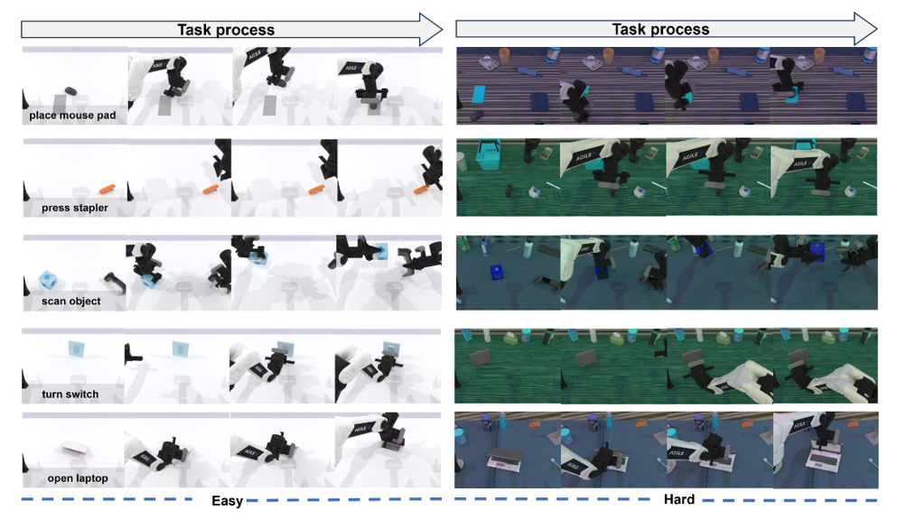

# Reference Results

## Provenance

The tables in this file are transcribed from the project report `SIV-WAM_项目报告_.docx` (revised October 1, 2026). The cleaned GitHub release does **not** include the checkpoint, dataset, simulator, or raw evaluation logs, so these values should be treated as a reference record rather than an automatically reproduced result.

For a publishable result, record at least:

- checkpoint path and training step;
- task split and Easy/Hard setting;
- number of evaluation seeds and episodes per task;
- configuration hash and code revision;
- mean success rate with standard deviation or a confidence interval;
- per-task results and rollout/video identifiers.

## Main ablation table

| Variant | Future RGB | SIV map | Interaction mask | Post-training | Easy SR | Hard SR | Purpose |
| --- | :---: | :---: | :---: | :---: | ---: | ---: | --- |
| E0 No-Map | ✓ | - | - | - | 87.6% | 84.9% | ordinary world-action baseline |
| E1 Aux-Map | ✓ | ✓ | - | - | 89.8% | 87.2% | auxiliary spatial supervision |
| E2 SIV + Mask | ✓ | ✓ | ✓ | - | 92.5% | 91.6% | structured world → SIV → action route |
| E3 GT-Map Oracle | ✓ | GT | ✓ | - | 96.2% | 94.8% | map-prediction upper bound |
| E4 + Value-Guided PT | ✓ | ✓ | ✓ | ✓ | **93.2%** | **92.3%** | action distribution calibration |
| E5 Latent-only | latent | ✓ | ✓ | - | 93.0% | 92.0% | tests whether RGB decoding is necessary |
| E6 Shuffled-SIV | ✓ | shuffled | ✓ | - | 71.8% | 68.9% | intervention test for SIV dependence |

The report's aggregate entry for Stage I is 92.5% Easy / 91.6% Hard. Stage II adds approximately **+0.6 percentage points** on the aggregate record (93.2% / 92.3%). The GT-Map row is an oracle and must not be presented as a deployable model.

## SIV map metrics

| Model | Hit@20 ↑ | Peak distance ↓ | Soft-IoU ↑ | Action-value consistency ↑ | Map entropy ↓ |
| --- | ---: | ---: | ---: | ---: | ---: |
| Aux-Map | 76.1% | 20.8 px | 0.511 | 0.706 | 2.31 |
| SIV-WAM Stage I | 82.7% | 15.9 px | 0.586 | 0.842 | 1.94 |
| SIV-WAM Stage II | 82.8% | 15.8 px | 0.588 | 0.861 | 1.92 |
| GT-Map Oracle | 100.0% | 0.0 px | 1.000 | 0.957 | 1.37 |

## Task-group breakdown

| Task group | Stage I Easy | Stage I Hard | Stage II Easy | Stage II Hard | Average change |
| --- | ---: | ---: | ---: | ---: | ---: |
| Pick / Handover | 93.8% | 93.0% | 94.5% | 94.2% | +0.9 pp |
| Placement / Transfer | 93.0% | 91.3% | 93.6% | 91.9% | +0.6 pp |
| Articulation / Contact | 96.0% | 96.4% | 96.7% | 97.4% | +0.9 pp |
| Stack / Ranking | 88.8% | 86.5% | 89.7% | 87.0% | +0.7 pp |
| Other | 88.0% | 89.2% | 88.5% | 89.5% | +0.4 pp |

## Server-side validation of this source snapshot

These are source-level checks executed in the server environment used to run the project:

| Suite | Result | Note |
| --- | --- | --- |
| `tests/` | 25 passed | includes geometry, objective, smoke-training, checkpoint-resume, and model-interface tests |
| `data_process/tests/` | 20 passed, 1 skipped | the skipped test requires a local RoboTwin dataset |

The test suite validates code paths and small synthetic examples. It does not replace a full GPU training run or a 50-task RoboTwin evaluation.

## Visual evidence

### Easy and Hard task process

  

### SIV Map generation

  

## Interpretation

The most important result is not only the average success rate. The intervention row drops sharply when SIV maps are shuffled, while the GT-Map Oracle remains higher than predicted-map variants. Together these numbers support two hypotheses recorded in the report:

1. a structured spatial interface can improve the world-to-action route; and
2. map prediction quality remains a bottleneck between the current model and the oracle.

These are hypotheses supported by the reference record, not guarantees for a new checkpoint or a different simulator version.
